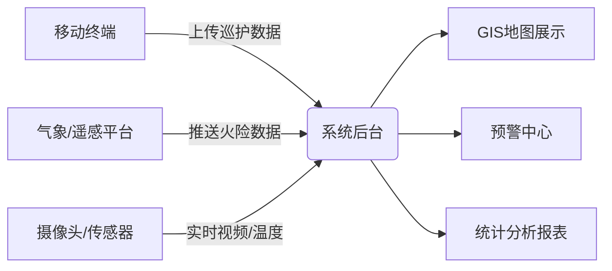

以下是一个**森林管护系统**的功能分析与系统设计，功能模块划分清晰，适用于林业管理部门、自然保护区或国有林场等场景。

---

## 一、系统概述

森林管护系统是一个集森林资源监测、巡护管理、火险预警、病虫害防治、数据统计与决策支持于一体的综合信息化平台。通过物联网、遥感、GIS、移动终端等技术，实现对森林资源的动态感知、智能分析和高效管理，提升森林生态系统的保护能力和管理水平。

---

## 二、功能分析

### 1. 用户与权限管理模块
- **用户管理**：支持管理员、管护员、巡护员、数据分析师等角色注册、信息维护。
- **权限控制**：基于角色的访问控制（RBAC），不同角色拥有不同操作权限（如查看、编辑、审批等）。
- **组织架构管理**：支持林场、管护站、巡护小组等多级组织管理。

### 2. 森林资源信息管理模块
- **基础资源数据录入**：录入林班、小班、树种、面积、蓄积量、龄组等属性信息。
- **地图可视化**：集成GIS地图，支持矢量图层管理、图斑查询、边界绘制。
- **资源变更记录**：记录采伐、补植、征占用等变更操作，支持历史回溯。

### 3. 巡护任务管理模块
- **任务派发**：管理员可按区域、周期、重点区域创建巡护任务（日常/专项）。
- **任务接收与执行**：巡护员通过移动APP接收任务，实时上传轨迹、照片、视频。
- **异常上报**：支持一键上报盗伐、火灾隐患、病虫害等异常事件。
- **任务审核与归档**：后台审核巡护记录，生成电子台账。

### 4. 森林防火预警模块
- **火险等级监测**：接入气象数据（温湿度、风速、降雨量），结合植被干湿度模型，动态计算火险等级。
- **热点监测**：集成卫星遥感或红外摄像头，自动识别高温热点。
- **预警推送**：火险高风险时自动向管护员推送预警信息。
- **应急预案管理**：维护火灾应急预案，支持快速启动与资源调度。

### 5. 病虫害监测与防治模块
- **病虫害数据库**：建立常见病虫害图谱、识别特征、防治方法。
- **AI识别支持**：通过移动端拍照，AI辅助识别病虫害类型。
  Assistant:
- **上报与处置**：上报病虫害位置、范围，系统自动派单给防治人员。
- **防治记录管理**：记录防治时间、药剂、效果等，形成闭环管理。

### 6. 野生动植物保护模块（可选）
- **物种信息库**：录入重点保护动植物名录、分布区域。
- **非法活动监控**：结合摄像头、红外相机识别盗猎行为。
- **栖息地评估**：定期评估栖息地质量，支持生态修复建议。

### 7. 数据统计与决策支持模块
- **多维报表**：生成巡护完成率、火险趋势、病虫害发生率等统计图表。
- **资源变化分析**：对比不同年份资源数据，分析森林健康状况。
- **Dashboard看板**：可视化展示关键指标（KPI），支持领导决策。

### 8. 移动端应用（配套）
- 支持Android/iOS，离线地图缓存、GPS定位、拍照上传、消息通知。
- 与后台实时同步数据，保障野外无网络环境下的可用性。

### 9. 系统集成与接口
- 与气象局、卫星遥感平台、视频监控系统等第三方对接。
- 提供API接口，支持未来扩展（如碳汇管理、生态补偿等）。

---

## 三、系统架构设计

### 1. 技术架构（分层设计）
- **表现层**：Web管理后台 + 移动APP（React/Vue + Flutter/React Native）
- **应用服务层**：
    - 巡护任务服务
    - 防火预警引擎
    - 病虫害识别AI服务
    - 权限与用户服务
- **数据服务层**：
    - 关系型数据库（PostgreSQL + PostGIS）
    - 时空数据库（存储轨迹、遥感数据）
    - 文件存储（图片、视频）
- **基础设施层**：
    - 云服务器（如阿里云、华为云）
    - 物联网平台（接入传感器、摄像头）
    - GIS引擎（如GeoServer、ArcGIS Online）

### 2. 数据流设计

### 3. 安全设计
- 数据传输加密（HTTPS）
- 用户操作日志审计
- 敏感数据脱敏（如GPS坐标精度控制）
- 定期备份与灾备机制

---

## 四、非功能性需求

- **可用性**：系统全年可用率 ≥ 99%
- **响应速度**：常规操作响应 < 2秒
- **并发能力**：支持500+巡护员同时在线
- **扩展性**：模块化设计，支持后续增加碳汇、生态旅游等模块
- **兼容性**：支持国产操作系统与数据库（如麒麟OS、达梦数据库）

---

## 五、总结

该森林管护系统以“**资源一张图、巡护一张网、预警一体化、决策一平台**”为核心理念，通过数字化、智能化手段，实现森林资源“看得见、管得住、防得早、治得好”的目标，为生态文明建设提供有力支撑。

如需进一步细化某个模块（如AI识别算法设计、GIS图层结构等），可继续补充说明。